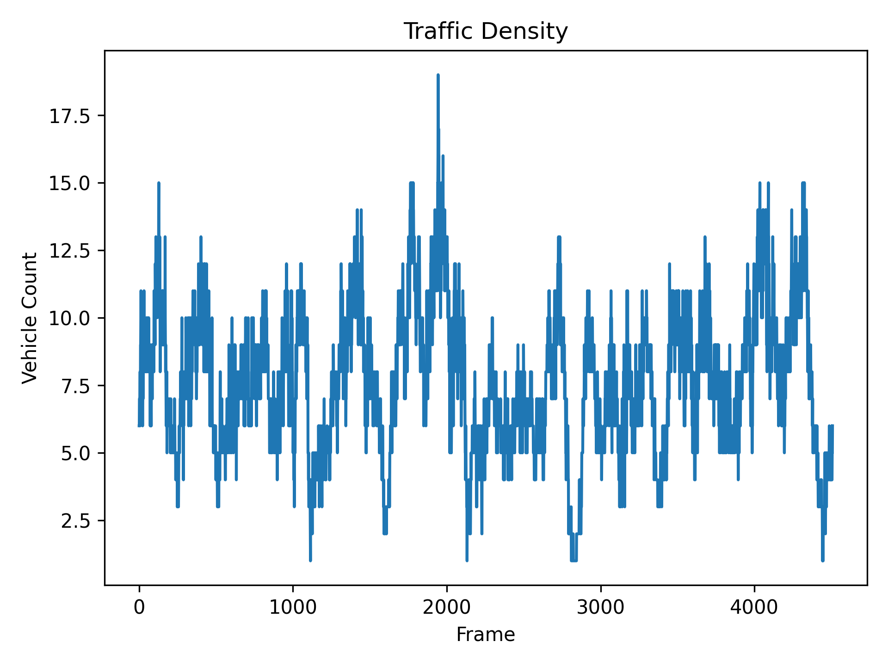
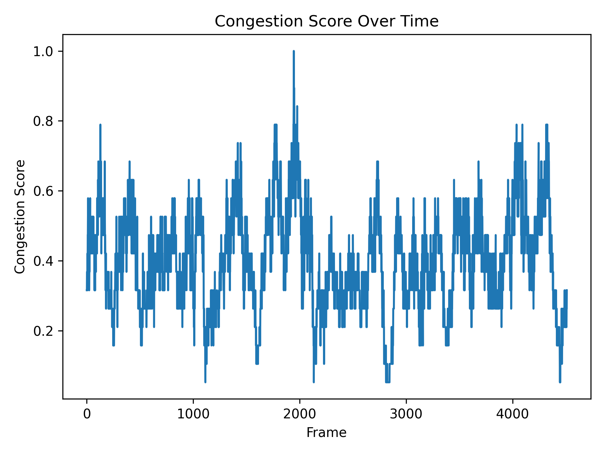

# Real-Time Traffic Monitoring Using YOLOv8 and Kalman Filter Tracking

This repository contains the full implementation, figures, and data outputs for the paper:

**Real-Time Traffic Monitoring Using Deep Learning and Multi-Object Tracking**  
Yoshua Alexander | The University of Texas at Dallas

This project demonstrates a lightweight vision-based system that detects, tracks, and analyzes traffic flow using only a single fixed video camera. Vehicle detections are generated using YOLOv8, and multi-object tracking is achieved via a Kalman filter with IoU-based association. From these tracks, the system computes frame-level vehicle density and a normalized congestion score. All results, figures, and code are included for full reproducibility.

---

## Features

* YOLOv8-based vehicle detection on each video frame  
* Multi-object tracking using a Kalman filter  
* Generation of unique, stable track IDs  
* Frame-level vehicle count extraction  
* Normalized congestion metric mapping traffic level to [0,1]  
* Automatic CSV export for both metrics  
* Plot generation for density and congestion curves  
* Fully reproducible pipeline requiring no GPU  

---

## Installation

### Clone the repository

```bash
git clone https://github.com/bforce541/traffic-density-yolo-kf.git
cd traffic-density-yolo-kf
```

### Install dependencies

```bash
pip install -r requirements.txt
```

This project uses Ultralytics YOLOv8, NumPy, OpenCV, and Matplotlib.

---

## Usage

### 1. Place your input video

Place your traffic video in the project root, for example:

```
input.mp4
```

### 2. Run the pipeline

```bash
python main.py --video input.mp4
```

This will automatically:

* Run YOLOv8 detections  
* Apply Kalman filter tracking  
* Output vehicle_count.csv and congestion_score.csv into the results/ directory  
* Generate visual plots into the results/figures/ directory  

---

## Generated Plots

### Vehicle Count Over Time

This plot shows the number of active tracked vehicles at each frame.

<p align="center">
  
</p>

---

### Congestion Score

This plot shows normalized congestion, scaled by the maximum observed vehicle count.

<p align="center">
  
</p>

---

## Methodology Summary

### Detection

YOLOv8 performs per-frame detection of vehicles. Each detection includes class labels, bounding boxes, and confidence values. Only vehicle classes are retained.

### Tracking

Multi-object tracking uses a Kalman filter with an 8-dimensional state vector:

```
[cx, cy, w, h, cx_dot, cy_dot, w_dot, h_dot]
```

IoU-based matching assigns detections to existing tracks. Tracks are created, updated, or deleted based on association results, resulting in stable identity tracking across frames.

### Traffic Density

Vehicle density for frame t is computed as:

```
N_t = number of tracked vehicles
```

### Congestion Score

Congestion is normalized relative to the maximum density observed across all frames k:

```
C_t = N_t / max_k(N_k)
```

This produces a congestion metric in the interval [0,1].

---

## Results Summary

* The system accurately tracks vehicles in a real highway video  
* Density curves capture natural fluctuations in traffic flow  
* The congestion metric highlights peak and low-load intervals  
* YOLOv8 detections combined with Kalman filtering ensure stable tracking without duplicate counts  

---

## Requirements

* Python 3.8+  
* Ultralytics YOLOv8  
* NumPy  
* OpenCV  
* Matplotlib  
